# 👟 SoleMate – Java Web Shoe Store

**SoleMate** is a fully functional e-commerce web application developed using **Java Servlets, JSP**, and the **MVC2 architecture**.

---

## 📌 Key Features

- 🏠 Home page with featured products  
- 🛍️ Product listing with search and filter options  
- 👟 Product detail page with descriptions and images  
- 🌟 Customer reviews and ratings  
- 🛒 Shopping cart with quantity updates and total price calculation  
- 💳 Checkout process with multiple payment methods  
- 🔐 User registration and login  
- 🛠️ Admin panel for managing products, orders, users, and viewing statistics  

---

## 🖼️ User Interface

### 🏠 Home  
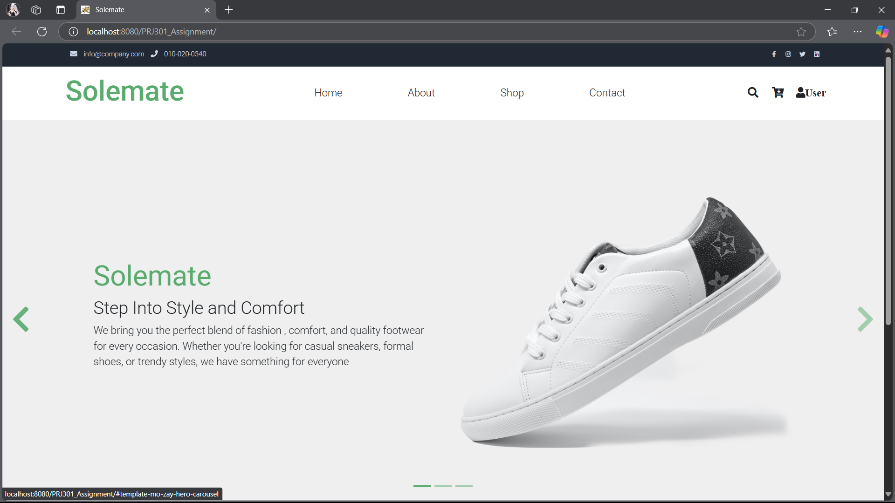

---

### 🛍️ Shop  
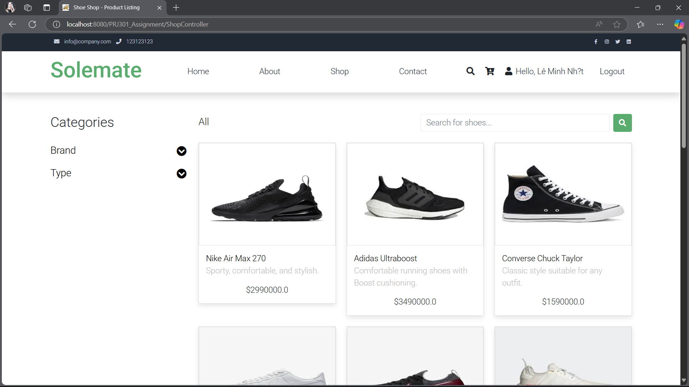

---

### 👟 Product Details  
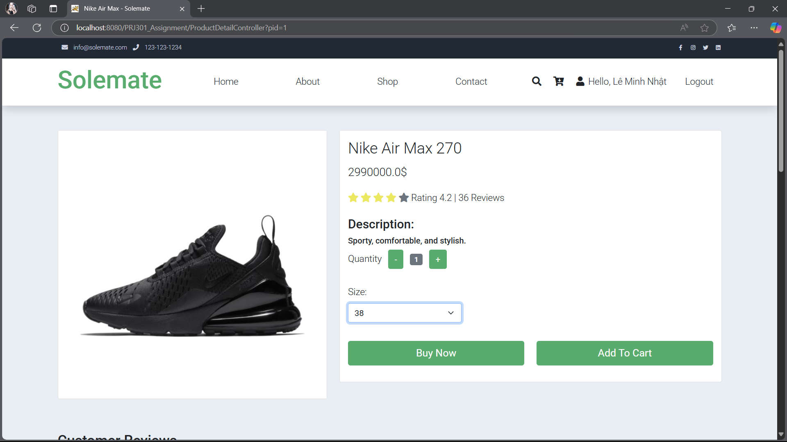

---

### 🌟 Reviews  
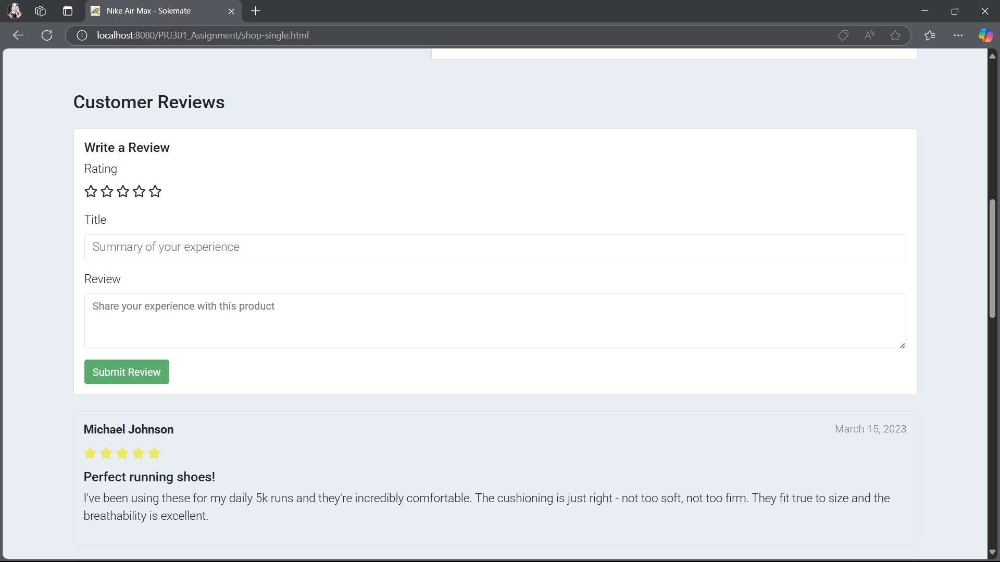

---

### 🛠️ Admin Panel

| Product Management | Order Management | Sales Dashboard |
|--------------------|------------------|------------------|
| 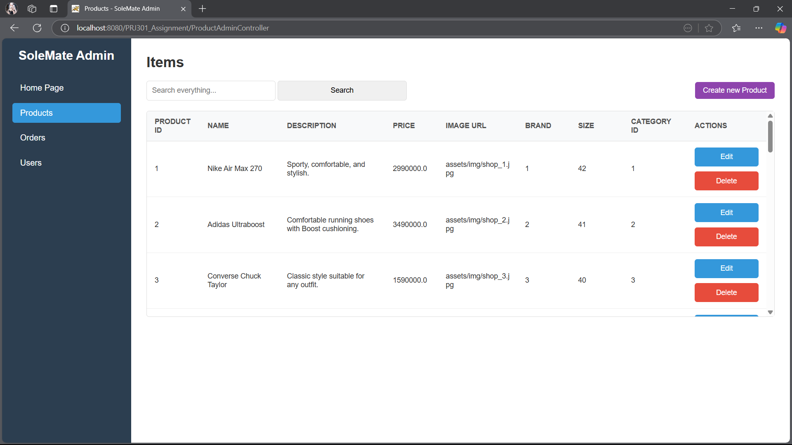 | 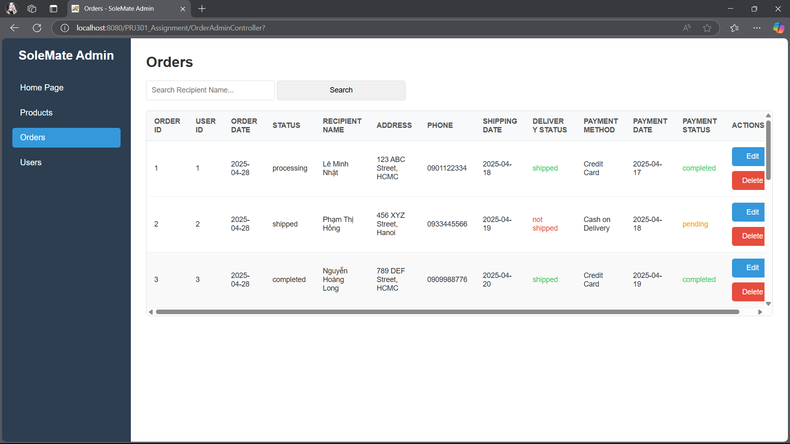 | 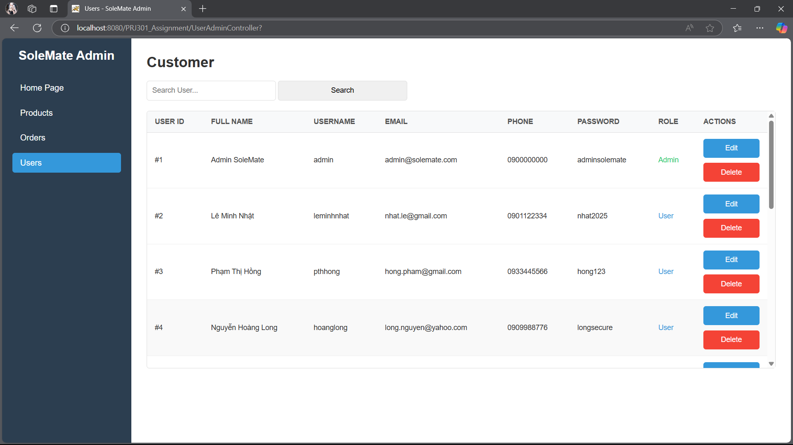 |

---

### 🛒 Shopping Cart  
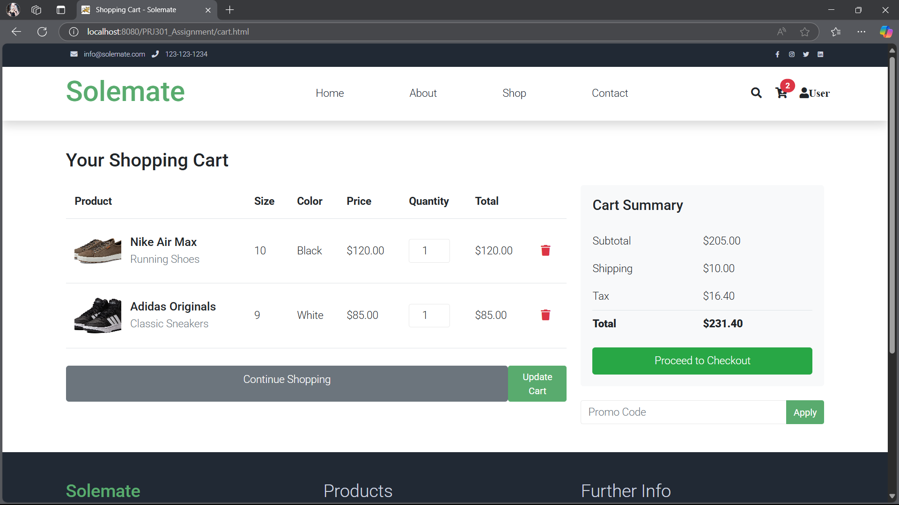

---

### 💳 Payment

| Checkout Summary | Payment Methods |
|------------------|------------------|
| 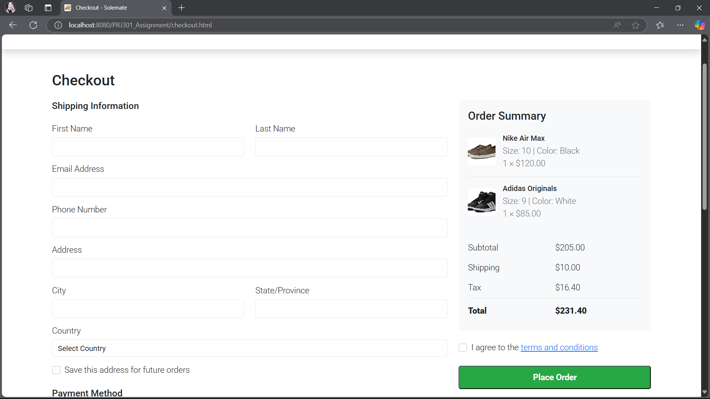 | 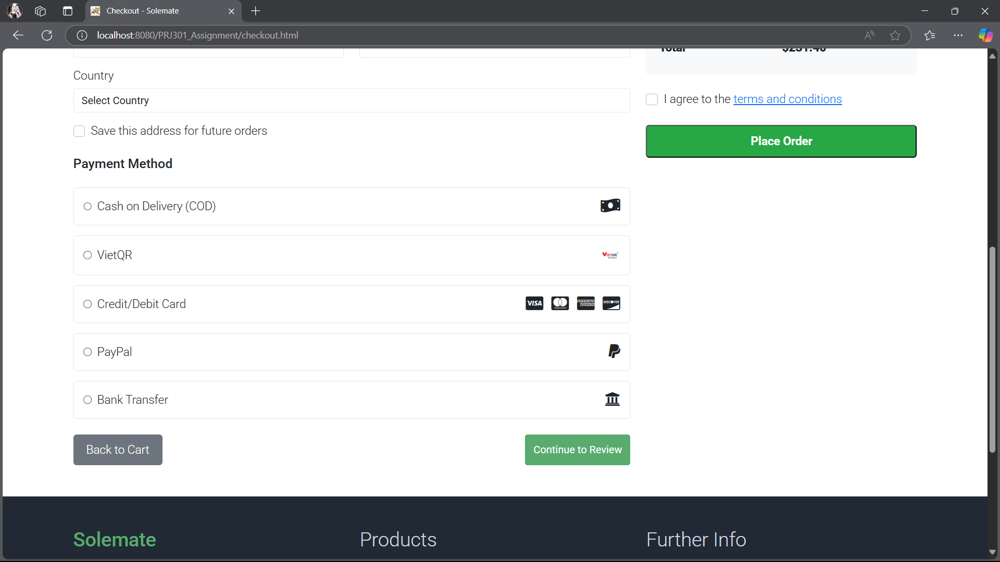 |

---

### 🔐 Login / Sign Up

| Sign Up | Sign In |
|--------|---------|
| 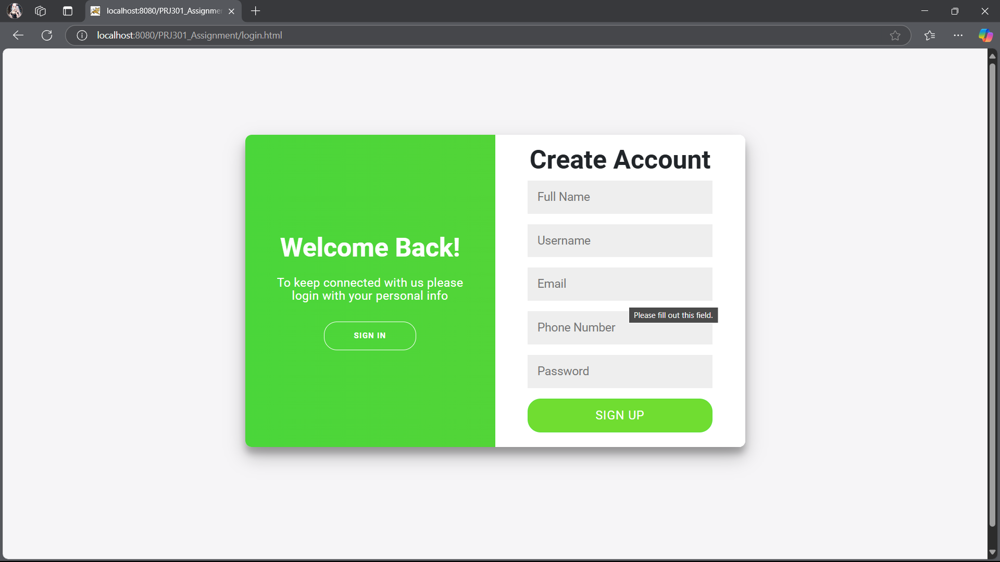 | 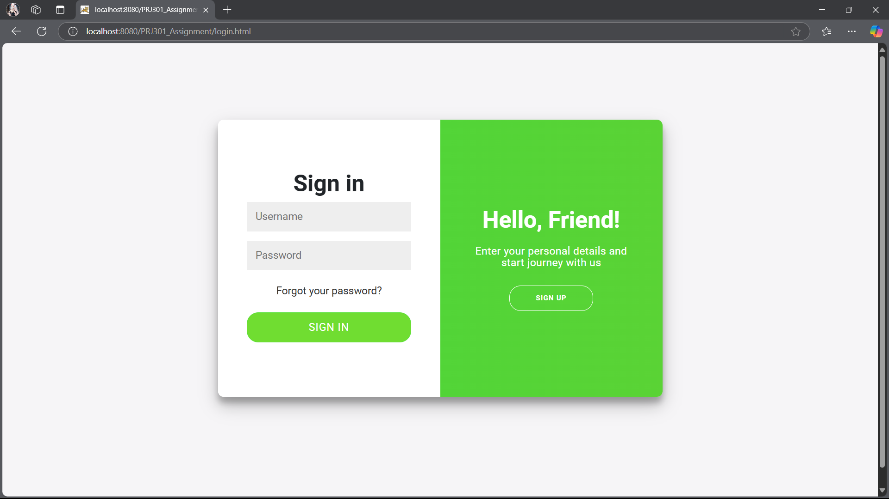 |

---

## 🔧 Technologies Used

- Java Servlet & JSP  
- JDBC  
- MVC2 Design Pattern  
- HTML, CSS, Bootstrap  
- SQL Server Database  
- JSTL  

---

## 💡 Project Overview

**SoleMate** offers a smooth online shopping experience with a modern, clean interface and full e-commerce functionality. The admin panel enables convenient management of products and orders, making it a solid prototype for real-world application.

---

## 📂 How to Run

1. Clone this repository  
2. Import the project into your IDE (Eclipse, IntelliJ, etc.)  
3. Configure your Apache Tomcat server  
4. Set up the database using the provided SQL script  
5. Run the project and explore the website!  

---

## 📬 Contact

For any questions or feedback, feel free to get in touch!

---

## 📦 Deliverables

### 1. UI Screenshots

- **Home Page**: Features highlighted products and navigation.  
- **Product Listing**: Includes search, filtering, and pagination.  
- **Product Details**: Images, descriptions, and reviews.  
- **Shopping Cart**: Manages quantities and updates total prices.  
- **Checkout & Payment**: Allows method selection and order confirmation.  

---

### 2. Database Design

- Entity Relationship Diagram (ERD):  

---

### 3. System Architecture

- **Model**: Manages data logic and database operations (Product, User, Order, etc.)  
- **View**: JSP pages for user interface  
- **Controller**: Servlets to manage data flow between Model and View (`ProductController`, `CartController`, etc.)  
- **Technologies**: Java Servlet, JSP, JDBC, HTML/CSS, Bootstrap, SQL Server  

| Main Program Structure |        Data Flow       |
|------------------------|------------------------|
| 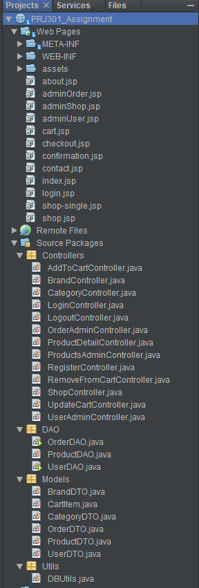 | 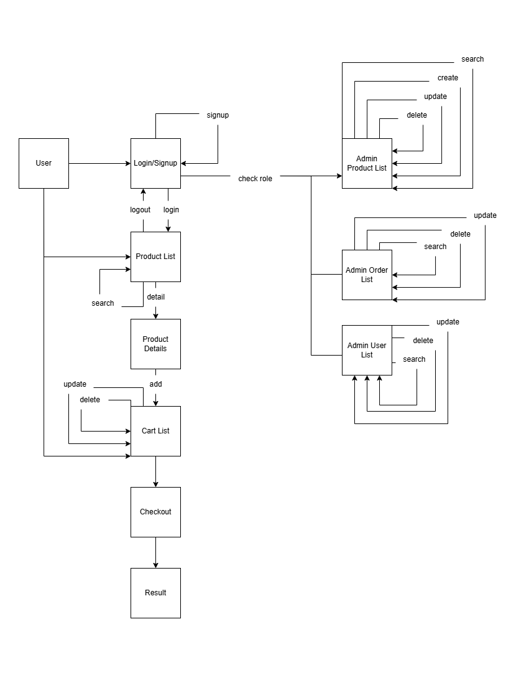 |

---

## ✅ Conclusion

### 1. Completed Features

- User registration and login  
- Product management  
- Shopping cart and checkout  
- Order management

### 2. Technical Stack

- Language: Java  
- Database: SQL Server  
- Source code organization

### 3. UI/UX Design

- Responsive and user-friendly design  
- Clear and accessible interface

---

## ⚠️ Limitations

### 1. Incomplete Features

- Search functionality needs improvement  
- Sorting features not fully implemented  
- Forgot password not available  
- Role-based access control not well defined  
- Admin data management is basic

### 2. Code and Structure

- Inconsistent naming for classes and packages  
- Folder structure needs better organization

---

## 🚀 Future Development

- Add more features  
- Improve UI/UX for better experience  
- Integrate new technologies (e.g., AJAX, Spring Boot)

---

## 💭 Reflections

### 1. Challenges

- **Timeline**: Started early but took longer due to lack of foundational knowledge  
- **Frontend vs Backend**: Initially focused too much on frontend, overlooked backend logic  
- **Teamwork**: Poor coordination combined with poor ability to use Git led to collaboration issues

### 2. Lessons Learned

- **Technical**: Better understanding of how web applications work, especially e-commerce sites in Java  
- **Soft Skills**: Importance of planning and effective team communication

---

⭐ *Thank you for checking out SoleMate – Where your steps begin in style!*
